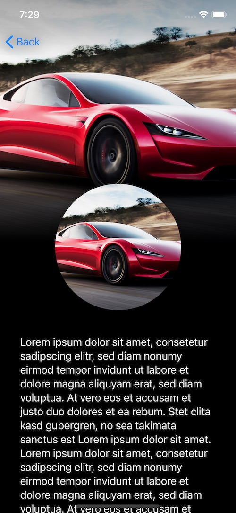

# SwiftUINavigationHeader



Create a great navigation header like this in SwiftUI with just a few lines of code

```
import SwiftUINavigationHeader

struct DetailView: View {
    var body: some View {
        NavigationHeaderContainer(bottomFadeout: true) {
            Image("roadster")
                .resizable()
        } content: {
            
            topView
                .transformEffect(.init(translationX: 0, y: -100))
                .padding(.bottom, -100)
            
            Text(loremIpsum)
                .font(.body)
                .padding(32)
        }

    }
    
    private var topView: some View {
        Image("roadster")
            .resizable()
            .scaledToFill()
            .clipShape(Circle())
            .shadow(radius: 10)
            .frame(width: 200, height: 200, alignment: .center)
    }
}
```

Subsequent views inside the same NavigationView should have the following added code snippet, to make sure the navigation bar is always in the correct state:

```
.navigationBarState(.compact, displayMode: .automatic)
```
